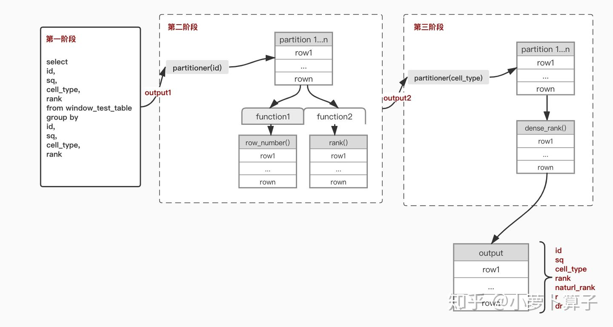

# SQL Interview

📚 Motivation: In life you can choose who you want to be; be very careful with that choice.

---

## 1.  SQL Basic

---

- FROM
- WHERE    :   NOT IN
- GROUP BY  :  Having,  ,  [ **Aggregate Functions:** Avg, Count, Sum],  COALESCE
- HAVING
- SELECT    :    NULL & <> ,  DISTINCT,   IF、 IFNULL(exp, value_if_null), case when
- ORDER BY


## **2. Advanced Queries and Joins**

---

- JOIN    :    Self-join,  Inner-join, Left-join,`CROSS-join`,   Cartesian product of two tables
- Subquery
- **GROUP BY**
- **Analysis Function :  SUM、COUNT**、**MIN、MAX、AVG**

## 3. **Window Function**

---

### **3.1 PTF**

window functions mainly relies on Partitioned Table Functions (PTF).

### **3.2 Ranking Analysis Functions**

**ROW_NUMBER()、 FIRST_VALUE**

| Function | Definition | Example |
| --- | --- | --- |
| **ROW_NUMBER()** | Assigns row numbers in partition, ordered by a column. | `ROW_NUMBER() OVER (PARTITION BY f1 ORDER BY f2)` |
| **RANK()** | Assigns rank, same rank for ties, skips numbers. | `RANK() OVER (PARTITION BY f1 ORDER BY f2)` |
| **DENSE_RANK()** | Like `RANK()`, but doesn't skip numbers. | `DENSE_RANK() OVER (PARTITION BY f1 ORDER BY f2)` |
| **FIRST_VALUE()** | first value in a partition. | `FIRST_VALUE(f2) OVER (PARTITION BY f1 ORDER BY f2)` |
| **LAST_VALUE()** | last value in a partition. | `LAST_VALUE(f2) OVER (PARTITION BY f1 ORDER BY f2)` |
| SUM (amount) | Cumulative sum for each partition. | `SUM(amount) OVER (PARTITION BY product ORDER BY date)` |
| **LAG() = pre, LEAD() = after** |  previous row / after row | `LAG(f2, 1) OVER (ORDER BY id)` |

---

### 3.3 SQL Action - Average / Spend Per Day > 3

---

### 📋 Sample Data: `transaction`

### **1. Identify Customers with Average / Spend Per Day > 3**

We are given a table `transaction` with fields:

- `customer_id` (string) - ID of the customer
- `txn_date` (date) - Date of the transaction
- `txn_time` (string) - Time of the transaction
- `txn_amount` (int) - Transaction amount

| customer_id | txn_date | txn_time | txn_amount |
| --- | --- | --- | --- |
| C001 | 2024-07-01 | 10:00:00 | 2 |
| C001 | 2024-07-01 | 15:30:00 | 1 |
| C001 | 2024-07-02 | 12:45:00 | 4 |
| C002 | 2024-07-01 | 11:00:00 | 5 |
| C002 | 2024-07-02 | 16:00:00 | 1 |
| C003 | 2024-07-01 | 09:00:00 | 3 |
| C003 | 2024-07-02 | 10:30:00 | 3 |
| C003 | 2024-07-02 | 13:15:00 | 1 |
| C004 | 2024-07-01 | 10:00:00 | 2 |

### ✅ Goal

The task is to identify customers whose average daily transaction amount is greater than 3.

---

🔹 **Approach** : 

1. Group transactions by `customer_id` and `txn_date` to calculate the total transaction amount for each customer on each day.
2. Calculate the average daily transaction amount by grouping by `customer_id` again.
3. Filter out customers whose average daily spend is greater than 3.

```sql
SELECT
    customer_id,
    AVG(daily_sum) AS average_spend
FROM (
    SELECT
        customer_id,
        txn_date,
        SUM(txn_amount) AS daily_sum
    FROM transaction
    GROUP BY customer_id, txn_date
) AS daily_spend
GROUP BY customer_id
HAVING AVG(daily_sum) > 3;
```

---

### 📊 Intermediate process（daily_sum）：

| customer_id | txn_date | daily_sum |
| --- | --- | --- |
| C001 | 2024-07-01 | 3 |
| C001 | 2024-07-02 | 4 |
| C002 | 2024-07-01 | 5 |
| C002 | 2024-07-02 | 1 |
| C003 | 2024-07-01 | 3 |
| C003 | 2024-07-02 | 4 |
| C004 | 2024-07-01 | 2 |

---

### 📈 Result：

| customer_id | average_spend |
| --- | --- |
| **C001** | (3 + 4)/2 = 3.5 |
| **C003** | (3 + 4)/2 = 3.5 |

### **2. Calculate Average Days Between Transactions for Each Customer**

### **Problem Statement:**

Given the same `transaction` table, calculate the average number of days between transactions for each customer.

---

### **Approach:**

1. Use the `LAG` window function to get the previous transaction date for each customer.
2. Calculate the difference in days between the current and previous transactions using `DATEDIFF`.
3. Group by `customer_id` and calculate the average.

---

Step 1: Get previous transaction date

| customer_id | txn_date | prev_transaction_date |
| --- | --- | --- |
| C001 | 2024-07-01 | NULL |
| C001 | 2024-07-01 | 2024-07-01 |
| C001 | 2024-07-02 | 2024-07-01 |
| C002 | 2024-07-01 | NULL |
| C002 | 2024-07-02 | 2024-07-01 |
| C003 | 2024-07-01 | NULL |
| C003 | 2024-07-02 | 2024-07-01 |
| C003 | 2024-07-02 | 2024-07-02 |
| C004 | 2024-07-01 | NULL |

Step  2: Calculate days between transactions

| customer_id | date_between_transactions |
| --- | --- |
| C001 | 0 |
| C001 | 1 |
| C002 | 1 |
| C003 | 1 |
| C003 | 0 |

Step 3： Calculate average days between transactions

```sql
-- Step 1: Get previous transaction date
WITH transaction_date AS (
    SELECT
        customer_id,
        txn_date,
        LAG(txn_date) OVER (PARTITION BY customer_id ORDER BY txn_date) AS prev_transaction_date
    FROM 
        transaction
)

-- Step 2: Calculate days between transactions
, date_diff AS (
    SELECT
        customer_id,
        DATEDIFF(txn_date, prev_transaction_date) AS date_between_transactions
    FROM transaction_date
    WHERE prev_transaction_date IS NOT NULL
)

-- Step 3: Calculate average days between transactions
SELECT
    customer_id,
    AVG(date_between_transactions) AS avg_days_transactions
FROM date_diff
GROUP BY customer_id;
```

## 4. Classic Questions

---

### 4.1  SQL : retained\_within\_30\_days



| seller_id | transaction_date | amount | currency |
| --- | --- | --- | --- |
| 101 | 2024-01-05 | 500 | USD |
| 102 | 2024-01-15 | 300 | USD |
| 101 | 2024-02-10 | 700 | USD |
| 103 | 2024-02-20 | 200 | USD |
| 102 | 2024-02-25 | 600 | USD |
| 101 | 2024-03-15 | 800 | USD |
| 103 | 2024-03-18 | 400 | USD |
| 102 | 2024-03-20 | 700 | USD |
| 101 | 2024-04-10 | 900 | USD |
| 103 | 2024-04-15 | 300 | USD |
| 102 | 2024-04-25 | 500 | USD |

Solution 1: Self Join + `BETWEEN AND`

Solution 2: Window Function + `LAG()`

```sql
SELECT
    t1.transaction_date AS current_date,
    COUNT(t1.seller_id) AS total_sellers,
    SUM(
        CASE
            WHEN t2.prev_transaction_date IS NOT NULL AND DATEDIFF(t1.transaction_date, t2.prev_transaction_date) <= 30 THEN 1
            ELSE 0
        END
    ) AS retained_sellers,
    ROUND(
        SUM(
            CASE
                WHEN t2.prev_transaction_date IS NOT NULL AND DATEDIFF(t1.transaction_date, t2.prev_transaction_date) <= 30 THEN 1
                ELSE 0
            END
        ) / COUNT(t1.seller_id), 2
    ) AS retention_rate
FROM
    seller_transactions t1
LEFT JOIN (
    SELECT
        seller_id,
        transaction_date,
        LAG(transaction_date, 1) OVER (PARTITION BY seller_id ORDER BY transaction_date) AS prev_transaction_date
    FROM
        seller_transactions
) t2 ON t1.seller_id = t2.seller_id
  
GROUP BY
    t1.transaction_date
ORDER BY
    t1.transaction_date;
```

---

### 5.9 Split live streams, highest number of online streamers

`SUM(tag) OVER (ORDER BY dt) AS amt`

---

| id | stt | edt |
| --- | --- | --- |
| 1001 | 2021-06-14 12:00:00 | 2021-06-14 18:00:00 |
| 1003 | 2021-06-14 13:00:00 | 2021-06-14 16:00:00 |
| 1004 | 2021-06-14 13:00:00 | 2021-06-14 20:00:00 |
| 1002 | 2021-06-14 15:00:00 | 2021-06-14 16:00:00 |
| 1005 | 2021-06-14 15:00:00 | 2021-06-14 20:00:00 |
| 1001 | 2021-06-14 20:00:00 | 2021-06-14 23:00:00 |
| 1006 | 2021-06-14 21:00:00 | 2021-06-14 23:00:00 |
| 1007 | 2021-06-14 22:00:00 | 2021-06-14 23:00:00 |

#### S1: Split the data

| dt | tag |
| --- | --- |
| 2021-06-14 12:00:00 | 1 |
| 2021-06-14 18:00:00 | -1 |
| 2021-06-14 20:00:00 | 1 |
| 2021-06-14 23:00:00 | -1 |
| 2021-06-14 15:00:00 | 1 |
| 2021-06-14 16:00:00 | -1 |
| 2021-06-14 13:00:00 | 1 |
| 2021-06-14 16:00:00 | -1 |
| 2021-06-14 13:00:00 | 1 |
| 2021-06-14 20:00:00 | -1 |
| 2021-06-14 15:00:00 | 1 |
| 2021-06-14 20:00:00 | -1 |
| 2021-06-14 21:00:00 | 1 |
| 2021-06-14 23:00:00 | -1 |
| 2021-06-14 22:00:00 | 1 |
| 2021-06-14 23:00:00 | -1 |

Step 2: Calculate the cumulative number of online users at each point in time.

| dt | amt | 解释 |
| --- | --- | --- |
| 2021-06-14 12:00:00 | 1 | 1001 开播，总人数 1 |
| 2021-06-14 13:00:00 | 3 | 1003 和 1004 开播，总人数 3 |
| 2021-06-14 15:00:00 | 5 | 1002 和 1005 开播，总人数 5 |
| 2021-06-14 16:00:00 | 3 | 1002 和 1003 关播，总人数 3 |
| 2021-06-14 18:00:00 | 2 | 1001 关播，总人数 2 |
| 2021-06-14 20:00:00 | 3 | 1001 再次开播，1004 和 1005 关播，总人数 3 |
| 2021-06-14 21:00:00 | 4 | 1006 开播，总人数 4 |
| 2021-06-14 22:00:00 | 5 | 1007 开播，总人数 5 |
| 2021-06-14 23:00:00 | 2 | 1001, 1006, 和 1007 关播，总人数 2 |

max_online_count ： 5

```sql
-- Step 2: Calculate the maximum number of simultaneously online streamers
-- The max function is used to find the peak number of online streamers
SELECT 
    MAX(amt) AS max_online_count
FROM 
    (
        SELECT 
            dt, 
            SUM(tag) OVER (ORDER BY dt) AS amt -- Cumulative online count
        FROM 
            (
                -- Select start times and tag them as +1
                SELECT 
                    stt AS dt, 
                    1 AS tag
                FROM 
                    table1
                UNION ALL 
                -- Select end times and tag them as -1
                SELECT 
                    edt AS dt, 
                    -1 AS tag
                FROM 
                    table1
            ) temp1
    ) temp2;
```

---

### 5.10 Two Basketball Teams, LAG, LEAD, LAG

---

**Problem:** Two basketball teams played an intense game with alternating scores. After the game, you have a detailed table of the scores for both teams, recording the team (`team`), player number (`number`), player name (`name`), score (`score`), and score time (`scoretime` in datetime). Now, the teams want to reward the outstanding players based on their performance in the game. Please write an SQL query to calculate this.

问题：两支篮球队进行了激烈的篮球比赛，比分交替上升。比赛结束后，你有一张两队得分分数的明细表，记录了球队team，球员号码number，球员姓名name, 得分分数score 以及得分时间scoretime(datetime)。现在球队要对比赛中表现突出的球员做出嘉奖，所以请你用SQL统计出：

（1）连续三次（及以上）为球队得分的球员名单.

```sql
SELECT DISTINCT a.name, a.team 
FROM
(
    SELECT  
            *,
            LEAD(name, 1) OVER (PARTITION BY team ORDER BY score_time) AS ld1,
            LEAD(name, 2) OVER (PARTITION BY team ORDER BY score_time) AS ld2,
            LAG(name, 1) OVER (PARTITION BY team ORDER BY score_time) AS lg1,
            LAG(name, 2) OVER (PARTITION BY team ORDER BY score_time) AS lg2
    FROM basketball_game_score_detail
) a
WHERE  (a.name = a.ld1 AND a.name = a.ld2)   -- 当前记录与下两条记录相同
    OR (a.name = a.ld1 AND a.name = a.lg1)   -- 当前记录与上一条和下一条记录相同
    OR (a.name = a.lg1 AND a.name = a.lg2);  -- 当前记录与上两条记录相同
```

  (2): 比赛中帮助各自球队反超比分的球员姓名以及对应时间

```sql
SELECT 
    team,
    `number`,
    score_time,
    name,
    A_score_acum,
    B_score_acum,
    score_gap,
    last_score_gap,
    score_gap * last_score_gap AS product
FROM 
(
    SELECT  
           *,
           (A_score_acum - B_score_acum) AS score_gap,
           LAG(A_score_acum - B_score_acum, 1) OVER (ORDER BY score_time) AS last_score_gap
    FROM         
    (
        SELECT 
               *,
               CASE WHEN team = 'A' THEN score ELSE 0 END AS A_score,
               CASE WHEN team = 'B' THEN score ELSE 0 END AS B_score,
               SUM(CASE WHEN team = 'A' THEN score ELSE 0 END) OVER (ORDER BY score_time) AS A_score_acum,
               SUM(CASE WHEN team = 'B' THEN score ELSE 0 END) OVER (ORDER BY score_time) AS B_score_acum
        FROM basketball_game_score_detail        
    ) t1
) t2
WHERE score_gap != 0  -- 排除平分的情况
  AND score_gap * last_score_gap <= 0;  -- 判断分数差的符号变化，确定是否反超

```

---
